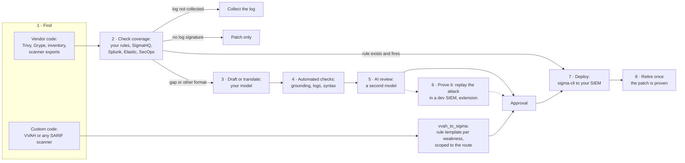

# vvah-to-sigma

Detection for the window between "we know we're vulnerable" and "the fix is deployed", for your own code
and for the vendor products you run. AI does the drafting; automated checks and an AI review speed up approval; a person approves what ships.



Every vulnerability gets an answer: a rule, a log to start collecting, or "patch only". Exploitation data
(CISA KEV, EPSS) sets the order of the work, not what gets a rule.

| Your code | Vendor code |
|---|---|
| `vvah_to_sigma`: vulnerabilities from Visa's VVAH scanner become scoped Sigma rules | `exposure_to_sigma`: CVEs in what you run, checked against your rules, public rules and the logs you collect; `exposure_to_sigma.draft` drafts or translates the missing rules |

## Results so far

Measured on two test targets. Example Corp is fictional; its inventory exists to exercise every path.

**PyGoat (your code).** VVAH confirmed 63 vulnerabilities. 18 are covered by 5 scoped rules, 8 sit behind
POST bodies that web logs don't record, 17 need behavioral baselines, 20 have no request-time signal.

**Example Corp (vendor code), 48 exploited CVEs on assets that send logs**, drafted by Claude Opus 5.
The first three rows are the drafter's own outcomes. The rest are review verdicts on the 25 rules it wrote,
from two reviews: a session review by an AI reviewer whose edits the author approved (the rules in
[`reviewed-rules/`](examples/example-corp/reviewed-rules/)), and the package's automated reviewer
(`--review`, a different model).

| Drafter outcome | CVEs |
|---|---|
| Correctly classified: no signature (DoS) or behavioral | 5 |
| Public text too thin: listed in `needs-input.md` | 16 |
| Model declined (inputs contained exploit write-ups) | 2 |
| Rule drafted | 25 |

| Review verdict on the 25 rules | Session review (approved) | Automated `--review` |
|---|---|---|
| Keep as drafted | 8 | 3 |
| Keep with edits | 11 | 11 |
| Hunting query, not an alert | 2 | 4 |
| Reject | 4 | 7 |

The automated checks (grounding, log source, `sigma check`) are a gate, not approval: of the 19 drafts that
passed all of them, review still sent most back for edits. The automated reviewer caught every problem the
session review found (a rule that fired on every failed VPN login, a generic "Java spawns a shell" rule with a
CVE name on it, a translation stricter than its source, web rules on firewall logs with no URLs) and some it
missed (hosts already patched, CVEs matched to the wrong product line). The two reviews agreed on 10 of 25
verdicts, which is why replaying the attack is the natural next layer. Details:
[`REVIEW.md`](examples/example-corp/reviewed-rules/REVIEW.md).

**Model choice:** use the best model you have access to. Security-specialized tiers offered to vetted
defenders refuse less on exploit material and should do better here. See [`model-profiles/`](model-profiles/README.md).

---

# vvah_to_sigma: your code

Turn findings from Visa's open-source [Vulnerability Agentic Harness (VVAH)](https://github.com/visa/visa-vulnerability-agentic-harness)
into [Sigma](https://sigmahq.io) detection rules, so a SOC can watch for exploitation of a known
vulnerability during the window between "found" and "fix deployed."

## Why

A scanner tells you the code is vulnerable. A patch fixes it, eventually. In between, the
vulnerability is known to you and exploitable by anyone who finds it. Detection rules scoped to the
exact weakness, and ideally the exact endpoint, cover that window, then get retired when the fix ships.

## What it does

For each finding in a VVAH SARIF report it decides, by CWE, which of four buckets applies:

| Bucket | Meaning | Output |
|---|---|---|
| **rule** | Exploitation leaves a signature in logs most teams collect (web access logs, process creation) | One or more Sigma rules |
| **behavioral** | Exploitation looks like a normal request from the wrong person (IDOR, missing authz) | No rule; explains what baselining is needed |
| **uncoverable** | No request-time signal (hardcoded secrets, weak crypto) | No rule; the fix is the only control |
| **unmapped** | No mapping yet | Flagged for manual review |

Every finding appears in `coverage.md`, including the ones it can't write rules for, and says why.
A tool that silently drops findings it can't handle gives false comfort.

Some findings get more than one rule. Command injection gets a web-payload rule (the attack arriving)
and a process rule (the app runtime spawning a shell, i.e. the attack succeeding). Deserialization gets
only the process rule, because its payload rides in cookies or bodies that web logs rarely record.

## Usage

```bash
pip install -r requirements.txt
python -m vvah_to_sigma path/to/<module>_<ts>_report.sarif --out out --repo path/to/scanned/app
```

`--repo` points at the source tree VVAH scanned. The tool reads it to scope each web rule to the
endpoint that reaches the vulnerable line, instead of watching the whole app:

- **Django:** follows `ROOT_URLCONF` through every `include()`, including `from .views import *` and
  class-based views (`.as_view()`). Parameterized paths like `item/<int:pk>` become prefix matches.
- **Flask:** reads `@app.route` / `@bp.route` decorators.
- **Templates:** a finding in an HTML template is mapped to the view(s) that render it.

It never guesses. A finding it can't resolve (settings files, Dockerfiles, unrouted helpers) gets an
unscoped rule, and `coverage.md` says why.

To override or add routes by hand, `--routes routes.yaml` maps a location to one or more URLs. Manual
entries win over derived ones:

```yaml
"introduction/views.py:120": /sql_lab
"introduction/views.py": /labs
```

`--min-confidence 0.8` skips rule generation for low-confidence findings (they still appear in the report).

## Which model runs the scan

The converter uses no LLM. The scan does, and you choose which: see
[`model-profiles/`](model-profiles/README.md) for Anthropic default, an Anthropic budget profile, and any
OpenAI-compatible endpoint (Gemini, local Ollama or vLLM).

## Validate and compile

```bash
sigma check -x attacktag -x d3_fendtag out/rules
sigma convert -t splunk --without-pipeline out/rules
sigma convert -t lucene --without-pipeline out/rules
sigma convert -t secops -p pipelines/secops_webserver.yml -p secops_udm out/rules
```

The `attacktag` check is excluded only where it can't download MITRE ATT&CK data; run it when online.

`pipelines/secops_webserver.yml` exists because the Google SecOps Sigma pipeline has no mapping for the
standard web-log fields (`cs-uri-query`, `cs-uri-stem`). It maps them to UDM `target.url`. Check how your
parser populates `target.url` (path only, or full URL with host): the endpoint-scoped rules assume a path.

## Limits

- Signature rules catch common payloads, not every encoding. They are a bridge until the fix ships, not
  a substitute for it.
- Process rules flag the app runtime spawning a shell. Baseline the children your app legitimately spawns
  before enabling them.
- Rule IDs are deterministic per finding, so re-running produces the same IDs and a SIEM can update rules
  in place rather than duplicating them.

## Tests

```bash
python -m pytest -q
```

The test fixture is a hand-written report in VVAH's Markdown format, converted to SARIF by VVAH's own
`md_to_sarif`, so the input matches what a real scan emits.


---

# exposure_to_sigma: vendor and dependency CVEs

Answers, for every CVE in what you run: **is it being exploited, and can you detect it today?**

```
 Trivy / Grype JSON ─┐
 Inventory CSV ──────┼──► exposures ──► exploitation feeds ──► rulesets ──► logs you collect ──► verdict
 Any scanner CSV ────┘                 (CISA KEV, EPSS,       (yours, SigmaHQ,
                                        paid intel)            vendor packs)
```

## Verdicts

| Verdict | Meaning | What to do |
|---|---|---|
| Detected by your rules | Your rule names the CVE and reads a log this asset sends | Confirm it's deployed |
| Public rule available: deploy it | A public rule names it and reads a log you collect | Deploy; retire after patching |
| Public rule in another format: translate it | No Sigma rule names it, but Splunk, Elastic or SecOps content does | Deploy it natively, or let the drafter translate it |
| Generic coverage likely (heuristic) | No rule names it, but a rule for the same weakness class reads a log you collect | Test before relying on it |
| Rule exists, logs not collected | The rule can never fire here | Fix the log pipeline, not the rule |
| No log signature (e.g. denial of service) | Nothing a rule could match | Patch |
| Gap | Nothing names it, nothing generic applies | Draft a scoped rule |

## Inputs

| Input | Flag | Notes |
|---|---|---|
| Trivy JSON | `--trivy` | `trivy fs --scanners vuln --format json` |
| Grype JSON | `--grype` | `grype dir:. -o json`; `--epss-from-grype` reuses the EPSS scores it embeds |
| Inventory CSV | `--inventory` | `asset,vendor,product,version,logs`; matched by product name, **version not checked** |
| Any scanner's CSV export | `--mapped-csv CSV MAPPING` | Tenable, Qualys, Wiz, Rapid7...: a YAML file names the columns |
| CISA KEV | `--kev` | `known_exploited_vulnerabilities.json` from cisagov/kev-data |
| FIRST EPSS | `--epss` | Daily CSV from first.org; CVEs above `--likely` (default 0.1) move up the queue |
| Paid threat intel | `--feed EXPORT MAPPING` | CSV or JSON export plus a field mapping |
| Rulesets | `--own-rules`, `--public-rules` | Any Sigma folders; repeatable |
| Other-format rules | `--other-rules` | Splunk `security_content/detections`, Elastic `detection-rules/rules`, Google SecOps `chronicle/detection-rules/rules`; matched by CVE only |

`logs` (in the inventory, or `--logs` for scanner inputs) lists the log sources that asset sends to your SIEM,
using Sigma's names: `webserver`, `proxy`, `process_creation:linux`, `process_creation:windows`, `fortios`,
`paloalto`, `cisco`. No inventory tool exports this today, so it is the one column you maintain by hand.

API connectors for scanners and intel platforms would implement the same interfaces as the file adapters
(`load_x(...) -> list[Exposure]`, `feed.lookup(cve) -> ExploitSignal`). Example mappings in
`examples/example-corp/` use illustrative column names: set them to your export's real headers.

## Run the examples

```bash
git clone --depth 1 https://github.com/cisagov/kev-data /tmp/kev-data
git clone --depth 1 https://github.com/SigmaHQ/sigma /tmp/sigma

python -m exposure_to_sigma --kev /tmp/kev-data/known_exploited_vulnerabilities.json \
  --inventory examples/example-corp/inventory.csv \
  --mapped-csv examples/example-corp/scanner-export.csv examples/example-corp/scanner-mapping.yaml \
  --asset hr-portal-01 --logs "webserver;process_creation:linux" \
  --own-rules examples/example-corp/rules \
  --public-rules /tmp/sigma/rules --public-rules /tmp/sigma/rules-emerging-threats \
  --out out/example-corp
```

Example Corp is fictional. Its inventory, rules and exports exist only to exercise every verdict.

## Draft rules for the gaps

`exposure_to_sigma.draft` takes the `exposures.json` above. For each **Gap** it asks the model you
choose to draft a scoped Sigma rule; for each **Public rule in another format** it asks it to translate that rule.
Assets that send logs come first.

```bash
python -m exposure_to_sigma.draft out/example-corp/exposures.json \
  --kev /tmp/kev-data/known_exploited_vulnerabilities.json --fetch-refs --only-logged \
  --nuclei /tmp/nuclei-templates \
  --provider anthropic --model claude-sonnet-4-6 --max 10 --out out/drafts \
  --review --review-model claude-opus-5-5
```

- **Every vulnerability, exploited first.** Every exposure gets a verdict and every gap gets a draft, because what
  isn't exploited today may be tomorrow. CISA KEV and EPSS only set the order (and `--max` caps a run), so nobody
  has to triage before a rule is written. A rule's severity doesn't depend on exploitation status: it fires only on an
  attempt, and an attempt is serious either way. `--exploited-only` (on both commands) restores the old behaviour. The
  inventory path only matches KEV CVEs; feed Trivy, Grype or a scanner export to cover everything else.
- **Grounded in text, not memory.** The model sees CISA KEV's description, NVD's (`--fetch-nvd`), up to three
  pages NVD links to, exploit write-ups first (`--fetch-refs`), and anything you add to
  `out/drafts/advisories/<CVE>.txt` (a vendor advisory, a paid intel write-up). Everything is cached. It is told
  to use only indicators stated there, and otherwise to answer `insufficient_info`, `behavioral` (an auth or MFA
  bypass that looks like a normal login) or `no_signature` (denial of service, offline attacks).
- **Structured sources first.** Translating an existing detection is safer than drafting one, and the grounding
  check then runs against the source rule. `--nuclei` adds the matching Nuclei template (the request a scanner sends
  to test for the bug), which carries exact paths and has no bot walls.
- **When public text runs out**, `needs-input.md` lists each CVE with the pages most likely to help. Open them in a
  browser, save to `advisories/<CVE>.html` (or paste into `.txt`/`.md`), and rerun with `--cve`. Commercial
  vulnerability intel plugs in the same way.
- **Refusals are an outcome.** Some models decline when the input contains exploit write-ups; that's recorded as
  `refused`, not an error.
- **Fetched pages are untrusted input.** The model has no tools and its output is checked, so the worst a hostile
  page can do is produce a bad draft that review rejects.
- **Rules that can fire come first.** Gaps on assets that send logs are drafted first; `--only-logged` skips the rest.
  A first run with NVD text alone drafted no rules: 9 of 10 were `insufficient_info`, because NVD descriptions
  rarely name a path or log message. That is the intended behaviour, not a failure.
- **Checked, not trusted.** Every value the rule matches on is searched for in the advisory text; misses are
  listed as *ungrounded*, HTTP methods and status codes are reported separately as context, not indicators. `--recheck` reruns all checks on an earlier run's rules (after you edit one, or add text to `advisories/`) without calling a model. The rule's log source is checked against what the affected assets send. `sigma check`
  runs when sigma-cli is installed. The model also says whether the CWE matches the text, which catches
  mislabels like a denial-of-service bug tagged as a buffer overflow.
- **AI review speeds up approval.** `--review` sends each rule, its source text and the check results to a second
  model that reviews it the way a detection engineer would: does it fire on normal traffic, is it really about this
  CVE or a generic rule with a CVE name, is a translation stricter or looser than its source, do the asset's logs
  carry the fields it needs, are there logic errors. It answers keep, edit, hunt or reject with the issues found, in
  `drafts.md` and `drafts.json`. It never edits a rule. Use a different model from the drafter
  (`--review-model`, `--review-provider`) for a more independent opinion, and `--recheck --review` to review an
  earlier run without redrafting. These are the problems that passed every automated check in the Example Corp run.
- **Drafts only.** Rules are written as `status: experimental` with a deterministic ID per CVE. Nothing here
  tests them against attack or benign logs yet; `drafts.md` is the sheet a person approves from.
- **Your model: use the best one you have access to.** Security-specialized model tiers, offered to vetted defenders
  through verified-access programs, refuse far less on exploit material and should do better here. General models
  work, but expect more `insufficient_info` and some `refused`. `--provider anthropic` reads `ANTHROPIC_API_KEY`. `--provider openai` works with any
  OpenAI-compatible server (`--base-url`, key from `OPENAI_API_KEY` or `--api-key-env`): OpenAI, Gemini's
  OpenAI-compatible endpoint, a local Ollama or vLLM. Keys are read from the environment and never written.
- `--dry-run` writes the prompts without calling a model, so you can see exactly what would be sent.

## Limits

- **Inventory matches ignore versions.** CISA's catalog lists products, not affected versions, so a product
  CSV over-reports. Feed it scanner output for version-accurate results.
- **"Generic coverage likely" is a heuristic** from CWE tags and rule titles. CWE tags can mislead: NVD tags
  some Django denial-of-service bugs as buffer overflows. Treat it as a lead, not a guarantee.
- **Native SIEM rules (SPL, YARA-L, KQL) are not analysed.** Only Sigma folders. Reading what an untagged
  native query detects is a separate problem.
- Test fixtures include rules copied from SigmaHQ under the Detection Rule License 1.1 (see the NOTICE there).
